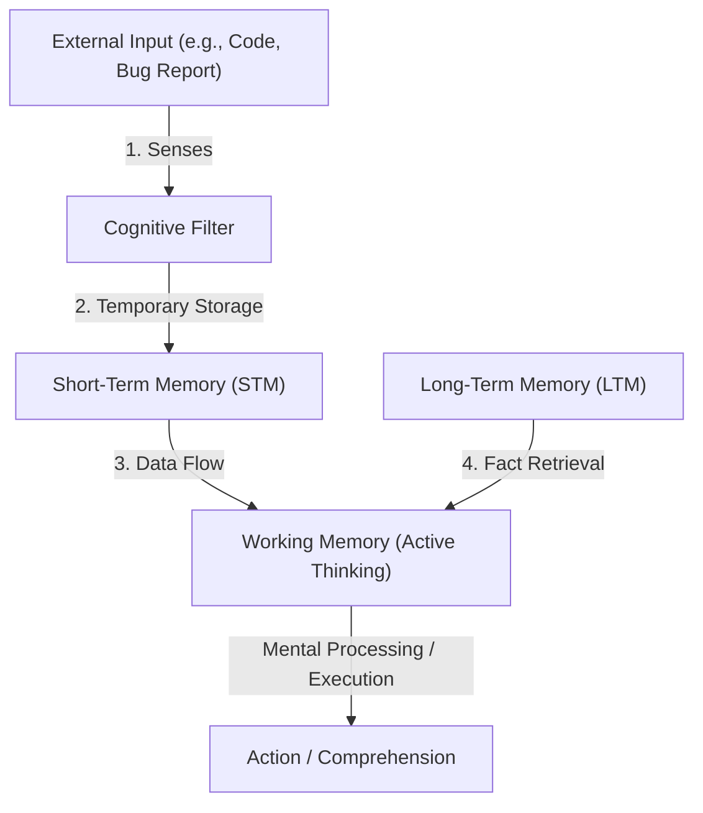

# Chapter 1 Summary: Decoding Your Confusion While Coding

This document summarizes **Chapter 1** of *The Programmer's Brain* by Felienne Hermans (located in [010_Part 1 On reading code better.pdf](file:///C:/Users/uid87429/OneDrive - Aumovio SE/1_ARCHIVE/029_BOOKS/4 - High Tech Career Playbook by Manning/The_Programmer's_Brain_chapters/010_Part 1 On reading code better.pdf)). 

---

## 1. Three Types of Confusion in Coding
When reading unfamiliar code, developers experience confusion. However, not all confusion stems from the same source. The chapter identifies three distinct types of confusion, illustrated by programs that convert a number $n$ to binary:

| Confusion Type | Description | Book Example | Root Issue |
| :--- | :--- | :--- | :--- |
| **1. Lack of Knowledge** | You do not know the syntax, keywords, or mathematical operators of the programming language. | An **APL** program utilizing the unfamiliar symbol `⊤` (dyadic encode function). | **Long-Term Memory (LTM)** |
| **2. Lack of Information** | You understand the syntax but are missing context or implementation details (e.g., helper methods defined elsewhere). | A **Java** program that calls `Integer.toBinaryString(n)` without displaying its definition. | **Short-Term Memory (STM)** |
| **3. Lack of Processing Power** | The logic is too complex to keep track of mentally; you cannot oversee all execution steps at once. | A **BASIC** program with a loop, variables changing values, and mathematical steps. | **Working Memory** |

---

## 2. Three Cognitive Processes of the Brain
To explain why these types of confusion occur, the chapter maps them to the three primary memory systems in human cognition:

### 🧠 Long-Term Memory (LTM)
* **Function:** Stores facts, experiences, rules, and syntax permanently.
* **Computer Analogy:** The **hard drive**.
* **Role in Programming:** Retrieves programming language syntax (keywords like `public static void`), algorithms (e.g., binary search), and domain-specific knowledge.
* **Issue:** A lack of knowledge means the required information is not stored in your LTM.

### 🧠 Short-Term Memory (STM)
* **Function:** Briefly holds sensory information (like a phone number or variable name) for a short period before it is discarded or processed further.
* **Computer Analogy:** **RAM** or a **cache**.
* **Role in Programming:** Temporarily tracks details like the type of variable $n$ or the name of a method as you scan through code.
* **Issue:** A lack of information forces the STM to hold too many pending items or requires extensive navigation, causing previous facts to be forgotten.

### 🧠 Working Memory
* **Function:** The space where active thinking, reasoning, and problem-solving occur.
* **Computer Analogy:** The **CPU** (Processor).
* **Role in Programming:** Performs "tracing" (mentally compiling and executing code step-by-step).
* **Issue:** A lack of processing power happens when the working memory is overloaded by too many variables and steps to compute simultaneously, causing cognitive fatigue.

---

## 3. Cognitive Processes in Collaboration
In practice, these memory systems do not work in isolation. They form a collaborative loop when you read or debug code:

### Collaboration Example: Reading Java Code
1. **STM:** You read a method parameter like `int n`. This type info is held in STM.
2. **LTM:** Your brain retrieves the concept of an `int` (an integer) and its properties from LTM.
3. **Working Memory:** Combines the current data in STM and the rules retrieved from LTM to comprehend the method's behavior. If an unfamiliar method is called (Lack of Information) or the logic is too nested (Lack of Processing Power), the working memory struggles to complete the integration.

---

> [!IMPORTANT]
> **Key Takeaway**
> To effectively resolve confusion while coding, you must first diagnose its root cause:
> - If it is a **knowledge** issue, you need to study and memorize the syntax/language features.
> - If it is an **information** issue, you need tools or strategies to trace definitions and document relationships.
> - If it is a **processing power** issue, you need memory aids (like writing intermediate values on paper or using refactoring to simplify code).
