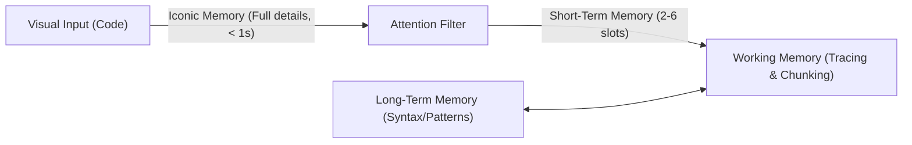

# Chapter 2 Summary: Speed Reading for Code

This document summarizes **Chapter 2** of *The Programmer's Brain* by Felienne Hermans (located in [010_Part 1 On reading code better.pdf](file:///C:/Users/uid87429/OneDrive - Aumovio SE/1_ARCHIVE/029_BOOKS/4 - High Tech Career Playbook by Manning/The_Programmer's_Brain_chapters/010_Part 1 On reading code better.pdf)).

---

## 1. The Bottleneck: Limits of Short-Term Memory (STM)
Research shows that programmers spend **60% of their time understanding code** rather than writing it. However, quickly reading code is hard because of the STM's physical limitations:
* **Duration Limit:** STM can hold information for **at most 30 seconds** unless it is rehearsed or transferred to Long-Term Memory (LTM).
* **Capacity Limit:** While George Miller famously estimated the STM limit as $7 \pm 2$ items, modern cognitive science estimates it is even smaller: **only 2 to 6 items**.

---

## 2. Overcoming the Limits: The Power of Chunking
To prevent information overload, the brain groups individual details into larger, recognizable patterns called **chunks**. This process relies heavily on prior knowledge stored in LTM.

### ♟️ The Chess Experiments (Adrian de Groot)
* **Real Setups:** Expert chess players recreated realistic board configurations from memory far better than average players.
* **Random Setups:** When pieces were placed randomly, experts performed **just as poorly** as average players.
* **Conclusion:** Experts do not have a larger physical STM; instead, they retrieve chunks (e.g., "a Sicilian opening") from LTM, occupying only 1 STM slot instead of many individual pieces.

### 💻 The Programming Scrambling Experiment (Katherine McKeithen)
* Repeating De Groot's study using 30-line ALGOL programs showed identical results.
* Experts reproduced realistic code far better than beginners. However, when the code lines were scrambled, experts and beginners performed equally poorly.
* **Conclusion:** Beginners cannot chunk code. They process code character-by-character or keyword-by-keyword, quickly filling their STM.

---

## 3. Sensory and Iconic Memory
Before code details reach the STM, they pass through sensory buffers:

* **Iconic Memory:** The visual cache in sensory memory. It temporarily stores a high-fidelity image of everything you see.
* **Sperling's Experiment (1960s):** Proved iconic memory holds a full visual grid of letters for a fraction of a second, but only a small portion can be transferred to the limited STM before the iconic trace fades.
* **"Code at a Glance":** Programmers can utilize iconic memory by scanning code formatting, whitespace, structure, and indentation before reading lines in detail to gain an initial structural overview.

---

## 4. Writing Chunkable Code
To help other developers read code quickly, we should structure it in a way that facilitates chunking:

### 🧩 Use Design Patterns
Walter Tichy's research demonstrated that using and documenting standard design patterns (like *Observer* or *Decorator*) significantly reduces the time professionals need to perform maintenance, provided they are trained to recognize the patterns.

### 📝 Write High-Level Comments
Comments shape how developers chunk code:
* **High-Level Comments** (e.g., `"This function prints a binary tree in order"`) assist in grouping large blocks of code into a single chunk.
* **Low-Level Comments** (e.g., `i++; // increment i`) do not help and add unnecessary noise, cluttering the STM.
* Beginners rely heavily on comments to navigate codebase files (Crosby's eye-tracking studies).

### 🚨 Leave Beacons
Beacons are semantic anchors that suggest what a program is doing.
* **Simple Beacons:** Single, self-explanatory code elements (e.g., a variable named `root`, or operators like `+` and `&&`).
* **Compound Beacons:** Groups of simple beacons that convey a unified meaning (e.g., `left` and `right` fields together indicating a binary tree node).

| Beacon Type | Description | Examples |
| :--- | :--- | :--- |
| **Simple Beacon** | Individual syntactic elements that act as context clues. | `tree`, `root`, `Node`, `+` |
| **Compound Beacon** | Multi-element structures that create a semantic pattern. | `self.left` + `self.right`; loop variable initialization + condition |

---

## 5. Deliberate Practice: Self-Diagnosis
The book recommends **deliberate practice** to improve chunking:
1. **Select Code:** Find a 30–50 line method in a language you know but haven't written recently.
2. **Study:** Inspect it for a maximum of 2 minutes.
3. **Reproduce:** Close the code and write down as much as you can from memory.
4. **Reflect:** Compare your code to the original. What you missed reveals gaps in your programming concepts or domain knowledge.
